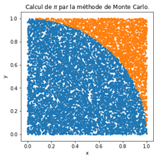

## Résultats
Score | Critères
--- | ---
1/1 | Index
1/1 | Coordonnées
0/1 | 64 valeurs
2/3 | **Total**

[Voir détails](./logs/tests_results.txt) | [Rafraîchir](../../)
# Exercices en vrac (chapitre 10)

Avant de commencer, consultez les instructions à suivre dans [instructions.md](instructions.md)

## Objectifs

Compléter les quelques exercices suivants en modifiant le code de [exercice.py](exercice.py):

1. Créer un array présentant 64 valeurs uniformément réparties entre -1.3 et 2.5.

2. Créer une fonction qui convertit une liste de coordonnées cartésiennes (x, y) en coordonnées polaires (rayon, angle).

3. Créer un programme qui trouve l’index de la valeur la plus proche d’un nombre fournit dans un array.

4. Créer un graphique de  dans l’intervalle [-1, 1] avec 250 points.

5. Créer un programme qui estime la valeur de pi avec la méthode de Monte-Carlo. Afficher le résultat ci-bas.

**Rappel mathématique**: Le rayon d'un cercle est pi. L'aire d'un demi cercle est pi/4.

6. Évaluer l’intégrale . Afficher dans un graphique  pour x = [-4, 4].
